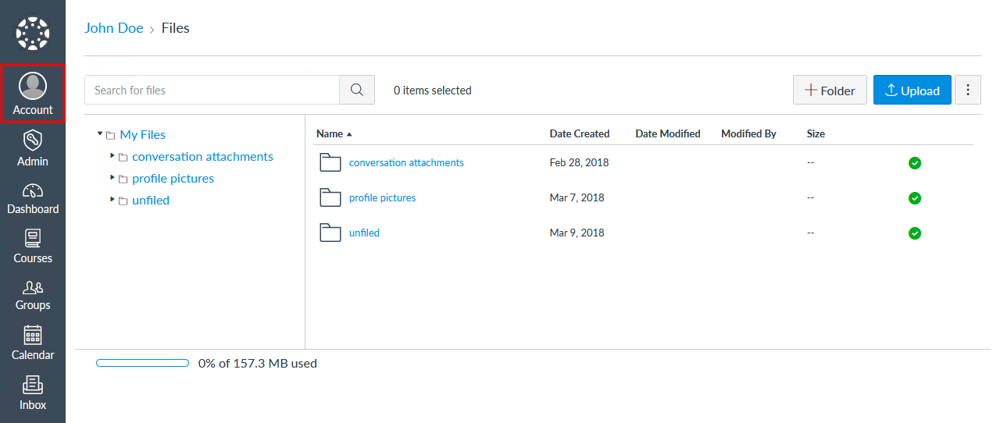
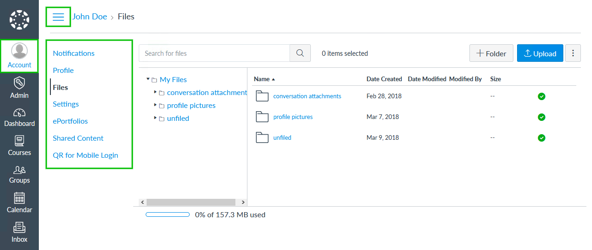
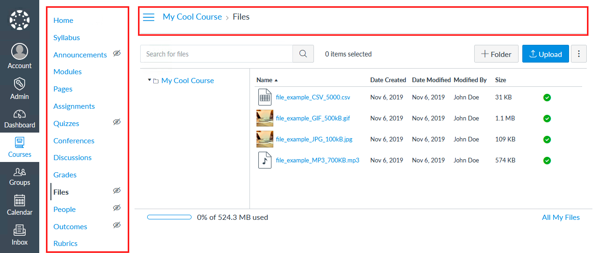
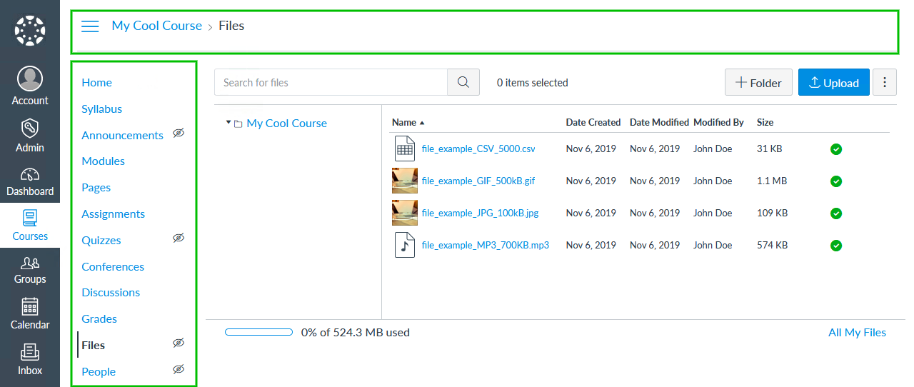

# Fix Files Navigation Plug-in

[](https://www.npmjs.com/package/@artevelde-uas/canvas-lms-fix-files-navigation-plugin)
[](https://spdx.org/licenses/MIT)
[](https://www.npmjs.com/package/@artevelde-uas/canvas-lms-fix-files-navigation-plugin)

Plug-in for the [Canvas LMS theme app](https://github.com/artevelde-uas/canvas-lms-app) that fixes some navigation issues on file explorer pages.

## Features

### My Files:

  * Adds the missing account navigation
  * Adds the missing toggle switch
  * Selects the 'Account' menu item in the main navigation

#### Before:


#### After:


### Course Files:

  * Move the course navigation down
  * Move the breadcrumbs to the top left

#### Before:


#### After:


## Installation

Using NPM:

    npm install @artevelde-uas/canvas-lms-fix-files-navigation-plugin

Using Yarn:

    yarn add @artevelde-uas/canvas-lms-fix-files-navigation-plugin

## Usage

Just import the plug-in and add it to the Canvas app:

```javascript
import canvas from '@artevelde-uas/canvas-lms-app';
import fixFilesNavigationPlugin from '@artevelde-uas/canvas-lms-fix-files-navigation-plugin';


canvas.addPlugin(fixFilesNavigationPlugin);

canvas.run();
```

### Options

#### `expandMyFilesMenu`

Gives you the ability to hide the profile menu by default. (Defaults to TRUE.)

```javascript
canvas.addPlugin(fixFilesNavigationPlugin, {
    expandMyFilesMenu: false
});
```
